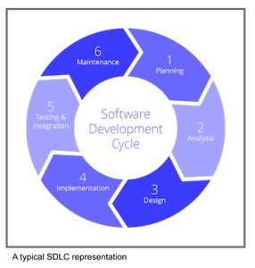

---

title: Secure Development and Integration
layout: col-document
tags: OWASP Developer Guide
contributors: Jon Gadsden
document: OWASP Developer Guide
order: 402

---



### 4.2 Secure development and integration

Secure development is described by the OWASP Software Assurance Maturity Model [(SAMM)][samm]
in the Design, Implementation and Verification business functions.
Much of the material in this section is drawn from the OWASP [Integration Standards project][ois].

#### Overview

Almost all modern software is developed in an iterative manner passing through phase to phase,
such as identifying customer requirements, implementation and test.
Theses phases are revisited in a cyclic manner throughout the lifetime of the application.
A generic Software Development LifeCycle (SDLC) is shown below, and in practice there may be more or less phases
according to the processes adopted by the business.

With the increasing number and sophistication of exploits against almost every application or business system,
most companies have adopted a secure Software Development LifeCycle (SDLC).
The secure SDLC should never be a separate lifecycle,
it must always be the same Software Development LifeCycle as before but with security actions built into each phase,
otherwise the security actions will be set aside by busy development teams.
Note that although the Secure SDLC could be written as 'SSDLC' it is almost always written as 'SDLC'.

DevOps integrates and automates many of the SDLC phases and implements Continuous Integration (CI)
and Continuous Delivery/Deployment (CD) pipelines to provide much of this automation.
DevOps and pipelines have been successfully exploited with serious large scale consequences
and so, in a similar manner to the SDLC, much of the DevOps actions have also had to have security built in.
Secure DevOps, or DevSecOps, builds security practices into the DevOps activities to guard against attack
and to provide the SDLC with automated security testing.
Examples of how DevSecOps is 'building security in' is the provision of
Interactive, Static and Dynamic Application Security Testing (IAST, SAST & DAST)
and implementing supply chain security, but there are many other security activities that can be applied.

{height=25%}

#### Secure development lifecycle

#### Secure CI/CD

DevSecOps

#### Further reading

#### Resources

* OWASP [Integration Standards project Application Wayfinder][ois]

----

The OWASP Developer Guide is a community effort; if you see something that needs changing
then [submit an issue][issue0402] or a [pull request][pr] .

[issue0402]: https://github.com/OWASP/www-project-developer-guide/issues/new?labels=enhancement&template=request.md&title=Update:%2004-foundations/02-secure-development
[ois]: https://owasp.org/www-project-integration-standards/
[pr]: https://github.com/OWASP/www-project-developer-guide/pulls
[samm]: https://owaspsamm.org/about/

\newpage
